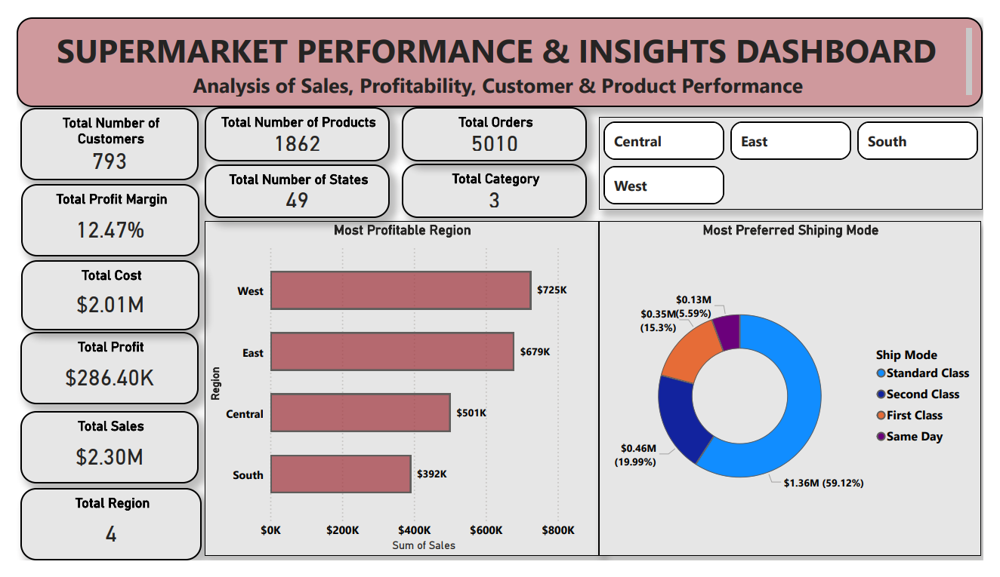
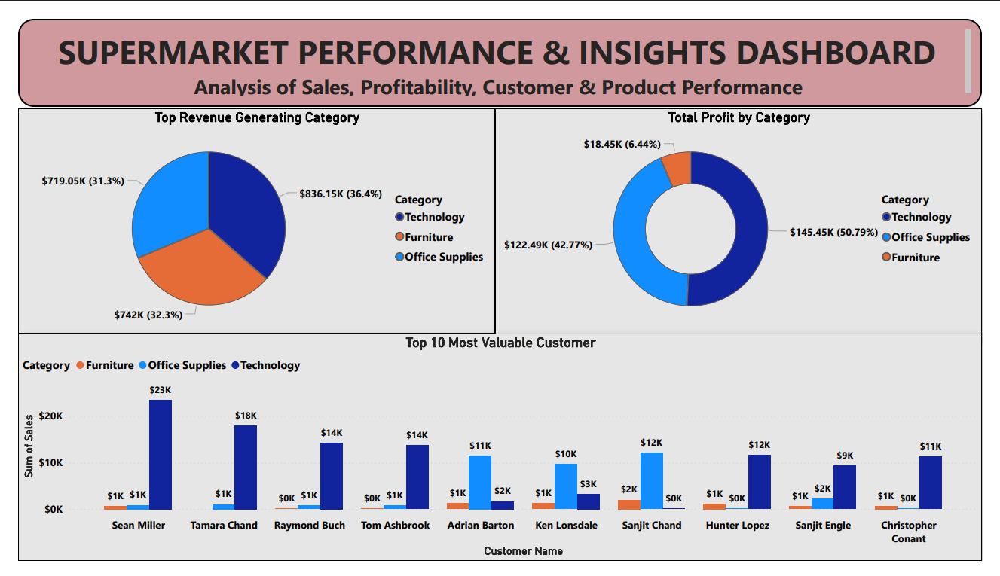
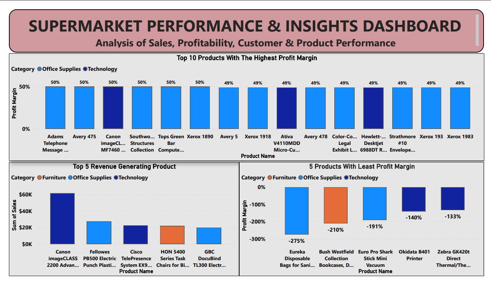
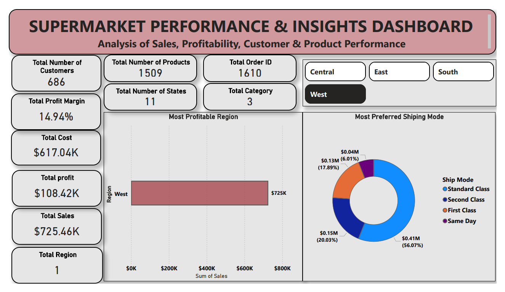
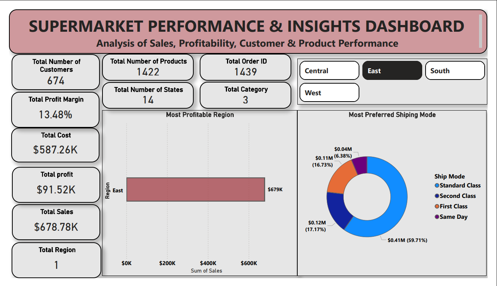
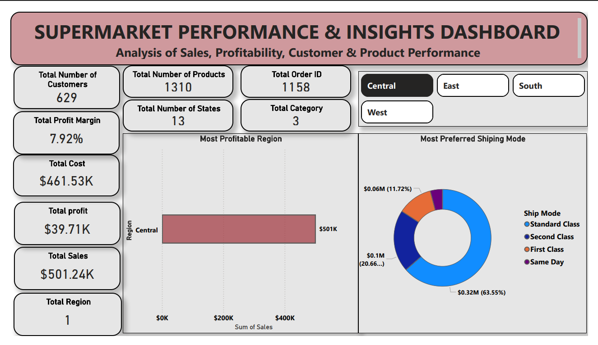
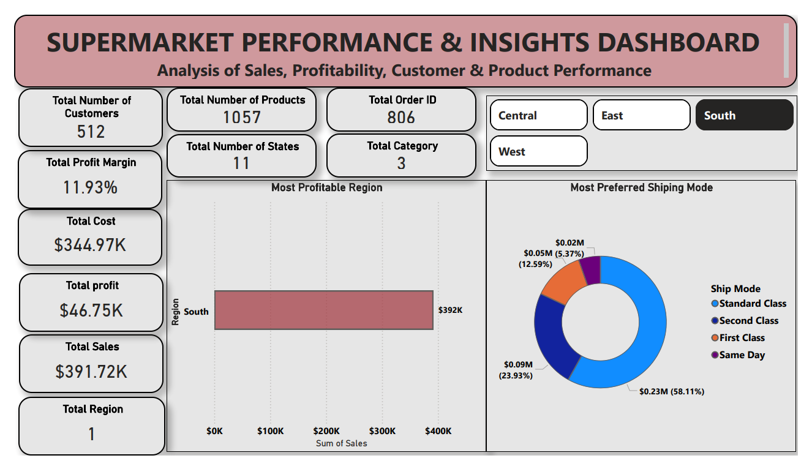

# 📊 Supermarket Performance & Insights Dashboard


An interactive **Microsoft Power BI** dashboard developed to analyze supermarket sales performance, profitability, customer behavior, and product performance using over **5,000 retail transactions**. The dashboard transforms raw transactional data into actionable business insights, enabling stakeholders to make informed, data-driven decisions.

---

## 📌 Project Overview

Retail businesses generate large volumes of sales data every day. Without an effective reporting system, it becomes difficult to identify trends, monitor performance, and uncover opportunities for growth.

This project addresses that challenge by providing a comprehensive Business Intelligence dashboard that enables users to:

- Monitor key business performance indicators (KPIs)
- Track sales and profit performance across branches
- Analyze customer purchasing behavior
- Evaluate product performance
- Compare branch performance
- Identify business trends over time

---
## 📑 Table of Contents

- [Project Overview](#-project-overview)
- [Business Objectives](#-business-objectives)
- [Dataset](#-dataset)
- [Tools & Technologies](#-tools--technologies)
- [Data Preparation](#-data-preparation)
- [Dashboard Pages](#-dashboard-pages)
- [Key Performance Indicators](#-key-performance-indicators)
- [Key Insights](#-key-insights)
- [Business Recommendations](#-business-recommendations)
- [Skills Demonstrated](#-skills-demonstrated)
- [Dashboard Preview](#-dashboard-preview)
- [Repository Structure](#-repository-structure)
- [Conclusion](#-conclusion)
- [Author](#-author)
  

## 🎯 Business Objectives

The dashboard was designed to answer key business questions, including:

- Which branches generate the highest revenue and profit?
- Which product lines contribute most to total sales?
- How do customers differ by gender and customer type?
- Which payment methods are most preferred?
- How do sales and profits change over time?
- Which products require more marketing or inventory attention?

---

## 📂 Dataset

The analysis is based on approximately **5,010 supermarket sales transactions**.

### Dataset Features

- Invoice ID
- Branch
- City
- Customer Type
- Gender
- Product Line
- Unit Price
- Quantity
- Tax (5%)
- Total Sales
- Date
- Time
- Payment Method
- Cost of Goods Sold (COGS)
- Gross Income
- Gross Margin Percentage
- Customer Rating

---

## 🛠 Tools & Technologies

- Microsoft Power BI
- Power Query
- DAX (Data Analysis Expressions)
- Data Modeling
- Data Visualization

---

## 🧹 Data Preparation

The following steps were completed before building the dashboard:

- Imported the raw dataset into Power BI
- Validated data quality
- Cleaned inconsistent records
- Corrected data types
- Created calculated measures using DAX
- Built an optimized data model
- Designed interactive visualizations with slicers and filters

---

# 📊 Dashboard Pages

## 1️⃣ Executive Dashboard

Provides a high-level overview of business performance using key metrics including:

- Total Sales
- Total Profit
- Profit Margin
- Total Orders
- Total Customers

---

## 2️⃣ Sales Performance Analysis

Analyzes:

- Sales by Branch
- Sales by City
- Sales by Product Line
- Sales Distribution
- Revenue Contribution

---

## 3️⃣ Profitability Analysis

Provides insights into:

- Profit by Branch
- Profit by Product Line
- Gross Income
- Profit Margin
- High and Low Performing Categories

---

## 4️⃣ Customer Insights

Explores customer characteristics including:

- Customer Type
- Gender Distribution
- Customer Ratings
- Payment Method Preferences

---

## 5️⃣ Product Performance

Evaluates:

- Quantity Sold
- Revenue by Product Line
- Product Contribution
- Product Profitability

---

## 6️⃣ Sales Trend Analysis

Tracks business performance over time through:

- Monthly Sales Trend
- Revenue Growth
- Sales Comparison
- Performance Monitoring

---

## 7️⃣ Business Insights Dashboard

Summarizes major findings through visual analytics, allowing stakeholders to quickly identify performance trends and business opportunities.

---

# 📈 Key Performance Indicators (KPIs)

| Metric | Value |
|---------|-------|
| Total Sales | **$2.30M** |
| Total Profit | **$286.40K** |
| Profit Margin | **12.47%** |
| Orders | **5,010** |
| Customers | **793** |

---

# 🔍 Key Insights

### Sales Performance

- The supermarket generated over **$2.30 million** in revenue across more than **5,000 sales transactions**.
- Revenue is not evenly distributed across branches, indicating opportunities for operational benchmarking.

### Profitability

- The business achieved a healthy **12.47% profit margin**, generating approximately **$286K** in profit.
- Certain product categories contributed significantly more to profitability than others.

### Customer Behavior

- Customer purchasing behavior differs across product lines and customer types.
- Multiple payment methods are actively used, highlighting the importance of maintaining flexible payment options.

### Product Performance

- Some product lines consistently outperform others in both revenue and profitability.
- Low-performing categories present opportunities for promotional campaigns or inventory optimization.

---

# 💼 Business Recommendations

### Increase Focus on High-Performing Products

Prioritize inventory availability and marketing campaigns for product lines generating the highest revenue and profit.

### Improve Underperforming Branches

Compare operational practices between high-performing and low-performing branches to identify improvement opportunities.

### Optimize Inventory Planning

Leverage historical sales trends to forecast demand and reduce stock shortages or excess inventory.

### Enhance Customer Experience

Use customer feedback and ratings to improve service quality and increase customer retention.

### Develop Targeted Marketing Campaigns

Create promotions based on customer purchasing patterns, product demand, and seasonal trends.

### Monitor Business KPIs Regularly

Adopt interactive dashboards for continuous performance monitoring and timely decision-making.

---

# 🚀 Skills Demonstrated

- Data Cleaning
- Data Transformation
- Power Query
- DAX Calculations
- Data Modeling
- KPI Development
- Interactive Dashboard Design
- Business Intelligence Reporting
- Data Visualization
- Business Performance Analysis
- Insight Generation
- Data-Driven Decision Making

---

## 📷 Dashboard Preview

### Executive Overview

Provides a summary of the supermarket's overall performance, including key KPIs such as Total Sales, Total Profit, Profit Margin, Total Orders, Customer Count, regional sales comparison, and preferred shipping methods.



---

### Category & Customer Analysis

This page analyzes revenue and profit by product category while highlighting the top 10 most valuable customers.



---

### Product Performance Analysis

This dashboard identifies the highest profit margin products, top revenue-generating products, and products with the lowest profit margins.



---

### West Region Dashboard

Detailed analysis of sales performance for the **West** region.



---

### East Region Dashboard

Detailed analysis of sales performance for the **East** region.



---

### Central Region Dashboard

Detailed analysis of sales performance for the **Central** region.



---

### South Region Dashboard

Detailed analysis of sales performance for the **South** region.


---

# 📁 Repository Structure

```text
supermarket-sales-performance-dashboard/
│
├── README.md
├── supermarket-performance-dashboard.pbix
├── supermarket_sales_dataset.csv
├── assets/
│   ├── executive-dashboard.png
│   ├── sales-performance.png
│   ├── profitability-analysis.png
│   ├── customer-insights.png
│   ├── product-performance.png
│   ├── sales-trend-analysis.png
│   └── business-insights.png
└── LICENSE
```

---

# 📌 Conclusion

This project demonstrates the application of Business Intelligence techniques to transform raw supermarket sales data into an interactive reporting solution. By combining Power Query, DAX, data modeling, and visualization, the dashboard delivers actionable insights into sales performance, profitability, customer behavior, and operational efficiency, enabling informed business decisions.

---

## 👨‍💻 Author

**Ehizogie Uwuigbe**

**Data Analyst | Microsoft Excel • SQL • Power BI**

- **GitHub:** https://github.com/Ehis-analytics
- **LinkedIn:** https://linkedin.com/in/ehizogie-uwuigbe-004728355

---

⭐ If you found this project useful, consider giving it a star!
